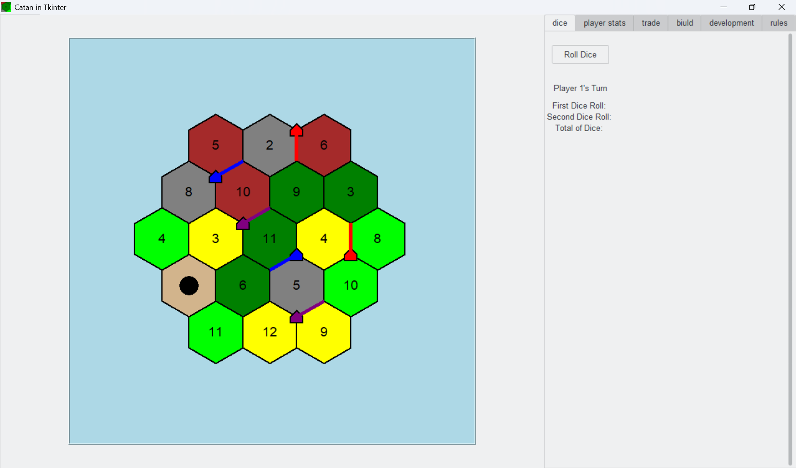

# 🎲 Tinkinan

A Python-based implementation of the board game Catan (Settlers of Catan) with a graphical user interface built using Tkinter.

## ✨ Features

- 🔷 **Hexagonal Game Board**: Dynamic hexagon-based board layout with procedurally generated resource tiles
- 👥 **Player Management**: Support for 3-4 players with individual resource tracking
- 🏗️ **Building System**: Place settlements, roads, and cities on the board with initial placement phase
- 🎴 **Development Cards**: Knight, Victory Point, Road Building, Year of Plenty, and Monopoly cards
- 💱 **Trading System**: Player-to-player resource trading interface
- 👹 **Robber Placement**: Place the robber on tiles to block resources and steal from opponents
- 🎲 **Dice Rolling & Resource Distribution**: Automated resource distribution based on dice rolls
- 📊 **Longest Route & Largest Army**: Automatic tracking and awarding of bonus victory points
- 💰 **Resource Discarding**: Automatic resource discard UI when a 7 is rolled (players with 8+ cards must discard half)
- 📈 **Player Statistics Tab**: Track resources, development cards, victory points, and special achievements
- 🏆 **Victory Points**: Track player progress toward the 10-point victory goal
- 💾 **Game Persistence**: Save and load past game data with full game state restoration
- 🎯 **Robust State Management**: Graph-based game state for accurate piece placement and resource tracking

## 📸 Demo



## 🚀 Getting Started

### 📋 Prerequisites

- Python 3.8+
- tkinter (usually included with Python)
- ttkthemes
- networkx (for route tracking)

### 📥 Installation

1. Clone the repository:
```bash
git clone https://github.com/yourusername/Tinkinan.git
cd Tinkinan

```
2. Install dependencies
```bash
pip install ttkthemes
```

3. Run the game
```bash
python src/main.py
```

## 🎮 How to Play
### 🎛️ Controls
- Press 'r' - Enter road building mode

- Press 's' - Enter settlement building mode

- Press 'c' - Enter city building mode

- Click on hexagon - Select a game piece

- Roll Dice Button - Roll dice and collect resources

## 📚 Game Rules
For detailed game rules, see the in-game Rules tab or check rules.txt.

## 📁 Project Structure

Tinkinan/

├── src/

│   ├── canvas.py          # Game board rendering and interaction

│   ├── game_struct.py     # Game state and logic

│   ├── game_loop.py       # Game turn management

│   ├── player.py          # Player class and resources

│   ├── tabs.py            # UI tabs (dice, trading, building, etc.)

│   └── main.py            # Entry point

├── config/

│   └── rules.txt          # Game rules

└── README.md


## 🛠️ Technologies Used

- **Python 3**: Core language
- **Tkinter**: GUI framework
- **ttkthemes**: Modern themed widgets
- **NetworkX**: Graph-based road/route tracking
- **SQLite**: Game persistence and history
- **Math module**: Hexagon geometry calculations

## 🤝 Contributing

Contributions are welcome! Please feel free to submit a Pull Request.

## 📄 License

This project is licensed under the MIT License - see the LICENSE file for details.

## 🙏 Acknowledgments

- Based on the board game Catan by Klaus Teuber
- Hexagon rendering algorithm adapted from geometry principles
- NetworkX library for efficient route tracking

## 📧 Contact

For questions or feedback, please open an issue on GitHub.